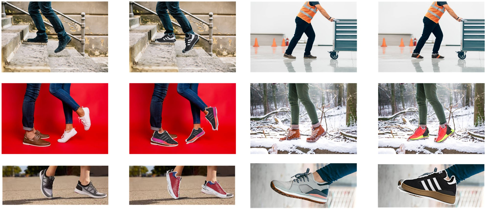

# Shoes-For-Life
UofM EECS504: Foundations of Computer Vision Fall 2020
The purpose of this project is to perform an overlay of a picture of a retailer shoes (Nike, Adidas, etc) over an image of the shoes of the user (customer). This project was inspired as a result of COVID-19 as many retailers are forced to shut down with the stay-in-home mandates. We hope this project will help consumers shop with confidence and as a allow the clothing industry to thrive despite being hit hard by the pandemic.  

  
*Sample images of overlaying user shoes with retailer shoes*

There were several steps that we took to accomplish this which will be outlined in this repository.  
* Detection
* Segmentation
* Image Stitching

## Detection
## Segmentation
The “EECS_504_Project Update.ipynb shows the extraction of the counter of the retailer shoes using super pixel map. Besides, it includes the foreground/background segmentation code we implemented, which won’t give an optimal consistent segmentation results for the user shoes images”
## Image Stitching

## Results
