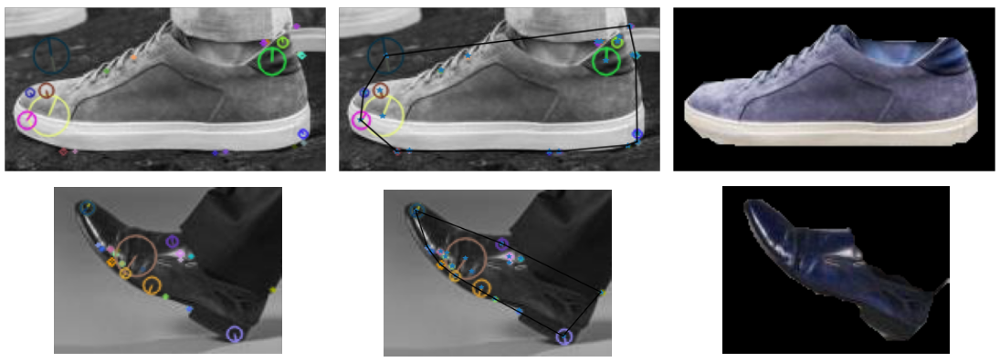

# Shoes-For-Life
**UofM EECS504: Foundations of Computer Vision Fall 2020**
The purpose of this project is to perform an overlay of a picture of a retailer shoes (Nike, Adidas, etc) over an image of the shoes of the user (customer). This project was inspired as a result of COVID-19 as many retailers are forced to shut down with the stay-in-home mandates. We hope this project will help consumers shop with confidence and as a allow the clothing industry to thrive despite being hit hard by the pandemic.  

  
*Sample images of overlaying user shoes with retailer shoes*

There were several steps that we took to accomplish this which will be outlined in this repository.  
* Detection
* Segmentation
* Image Stitching

## Detection
In the detection step, the YOLOv3 with weights pretrained on Open Images Dataset V6 is utilized. Some minor tweaks are added to accommodate the shoe-detection task:

* Only the class scores of `footwear`, `clothes`, and `boots` are extracted from the prediction tensor. The `clothes` label is preserved because we discovered that shoes often received higher prediction scores on this particular label.
* Discard the predictions with high `clothes` scores but low `footwear` ones to avoid classifying actual clothes as shoes.

All codes can be found under the `shoe_detection/` folder. The pretrained weights can be downloaded [here](https://pjreddie.com/media/files/yolov3-openimages.weights) or by executing the following command:

```shell
wget https://pjreddie.com/media/files/yolov3-openimages.weights
```

Please refer to `shoe_detection/detect_shoes.ipynb` for the main detection and visualization pipeline. In addition, the detection results on our self-collected dataset are stored in the `shoe_detection/output/` folder. 

## Segmentation
The segmentation need to be done for both retail shoes and user shoes.
A range map operation/function was implemented to do the segmentation for retail shoes. 
The user shoes having a more complex content need to use foreground/background segmentation follwing with the max flow/min cut graph cut algorithm.
The `Segmentation/Ford-Fulkerson.ipynb` shows the extraction of the counter of the retailer shoes using super pixel map. Besides, it includes the foreground/background segmentation code we implemented, which won’t give an optimal consistent segmentation results for the user shoes images.
As a result of the inconsistencies in foreground and background segmentation using Ford-Fulkerson, we use the grab-cut algorithm to segment the user pictures. However, to get good results, we also created a mask region to indicate probably foreground based on the contour (Convex Hull) from SIFT feature points. The `Segmentation/Grab-Cut.ipynb` can be ran to understand the preprocessing done before applying Grab-Cut on the user's photo for segmentation.
  
*Example of Segmentation using GrabCut*

## Image Stitching
The stitching algorithm consists of the following steps:
1. Find largest eigenvector of pixel coordinates for each segmentation map. Align shoes horizontally using these eigenvectors.
2. Make vertical and horizontal cuts to find contour points of segmentation map.
3. Use contours points to estimate similarity and homography transformation between shoes.
4. Pick the best similarity transform and the best homography transform each by first maximizing the number of inliers produced by RANSAC and then minimizing the least squares costs of inliers.
5. Pick the better transformation of the two bests by choosing the results that covers more of the user's shoe.

## Running the pipeline
The final pipeline and implementation of this project can be found in "Final Project.ipynb". This jupyter notebook integrates detection, segmentation, and image stitching to produce the a single image of the overlay of retail shoe onto the user's shoes. The notebook takes as input 
* Filepath of the user's image
* Filepath of the retail shoe image

